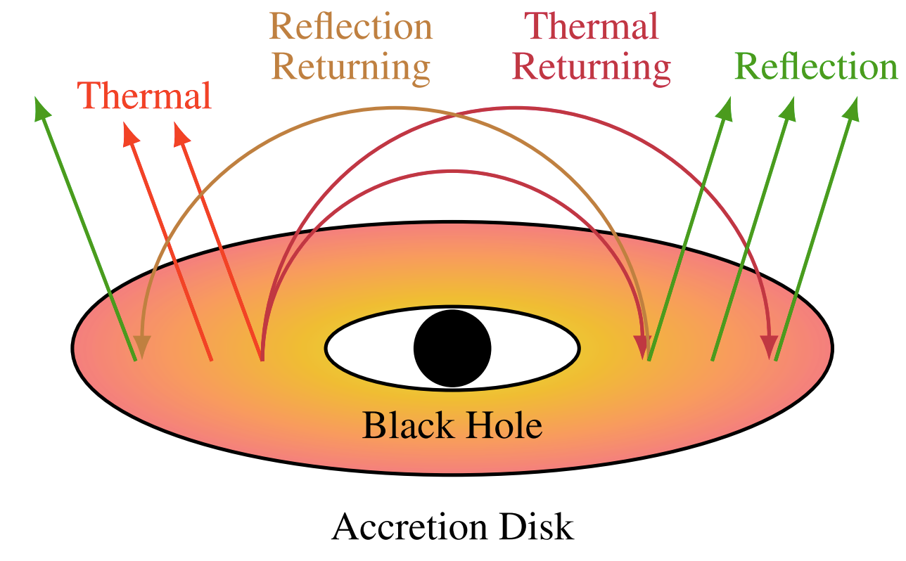

# `zijiRetRad` XSPEC Model

`**zijiRetRad**` is an additive table model for XSPEC, based on the `ziji` code [1,2].  
It simulates the X-ray **reflection** and **blackbody emission** of a corona-less black hole accretion disk system.

---

## Physical Description

The model assumes that disk illumination occurs purely through:

- Self-irradiation of the accretion disk  
- Higher-order (iterative) reflections  

This setup is particularly relevant for systems in the soft spectral state.

<p align="center">
  
</p>

---

## Model Components

The package contains three XSPEC table models:

- `zijiRetRad_bb.fits` — blackbody component  
- `zijiRetRad_ref.fits` — reflection component  
- `zijiRetRad_tot.fits` — total spectrum  

---

## Model Parameters

The model includes **five physical parameters**:

1. Electron density: $n_{\rm e}$
2. Spin parameter: $a_*$
3. Black hole mass: $M_{\rm BH}$
4. Mass accretion rate: $\dot{M}_{\rm BH}$
5. Inclination angle: $i$

---

## Normalization

The source distance is encoded in the XSPEC normalization:

$$
\mathcal{N} = 0.229 \frac{M^2}{D^2}
$$

- $M$ in solar masses ($M_\odot$)  
- $D$ in kpc  

---

## Parameter Grid

| Parameter | Values |
|----------|--------|
| Electron density ($\mathrm{cm^{-3}}$) | $10^{18}$ – $10^{22}$ |
| Spin $a_*$ | 0.8146 – 0.9982 |
| Mass ($M_\odot$) | 10 |
| Accretion rate ($10^{18}$ g/s) | 0.14 – 2.1 |
| Inclination ($^\circ$) | 30 – 75 |

See full grid details in [Kourmpetis et al. (2026)](https://doi.org/10.48550/arXiv.2601.14860) .

---

## Notes

- The model is calibrated for **4U 1630–47**, but is applicable to systems with similar physical parameters (mass, spin, inclination).
- Both blackbody and reflection components share the same parameter grid.

---

## Reference

If you use this model, please cite:

Kourmpetis et al. (2026)  
*Modeling X-Ray reflection spectra from returning radiation: application to 4U 1630–47*  
[arXiv:2601.14860](https://doi.org/10.48550/arXiv.2601.14860)

---

## Code

This model is based on the `ziji` code and framework:

[1] Mirzaev et al. (2024), *Toward More Accurate Synthetic Reflection Spectra: Improving the Calculations of Returning Radiation*, [Astrophys. J. 965, 66](https://iopscience.iop.org/article/10.3847/1538-4357/ad303b).

[2] Mirzaev et al. (2024), *X-ray spectra of black hole X-ray binaries with returning radiation*, [Astrophys.J. 976: 229 (2024)](
https://doi.org/10.3847/1538-4357/ad8a63).

---

## Usage in XSPEC

```bash
XSPEC> model atable{zijiRetRad_tot}


